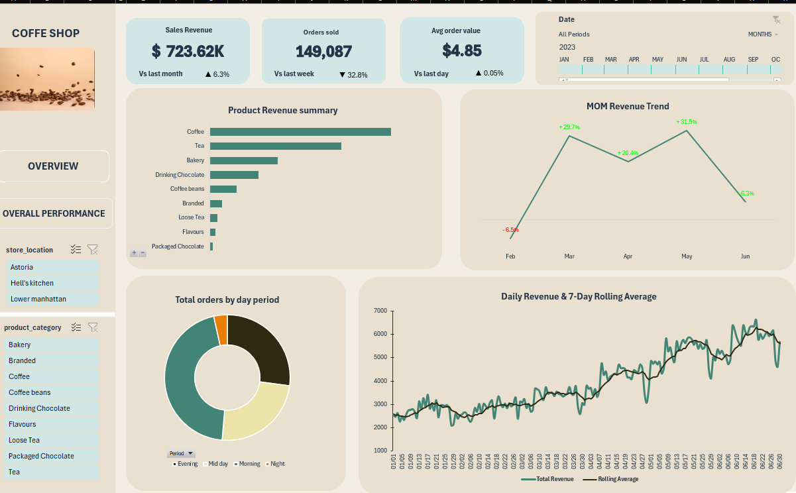
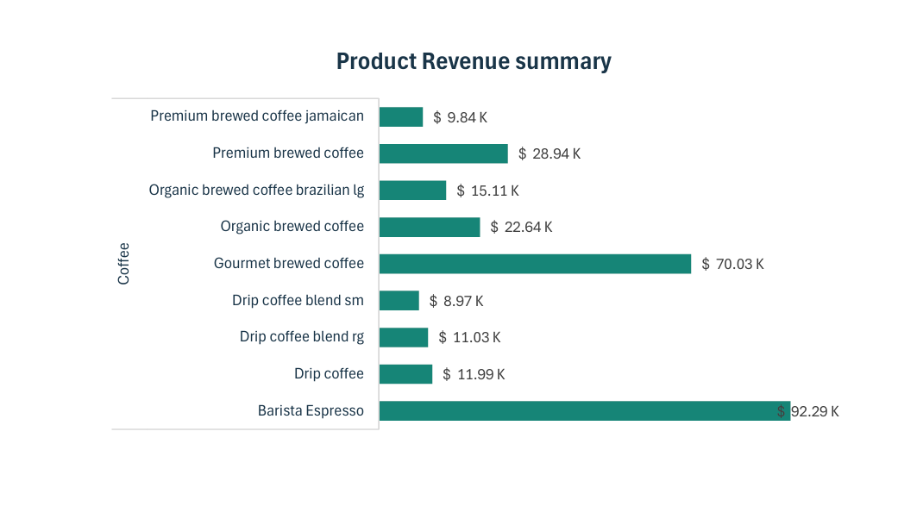
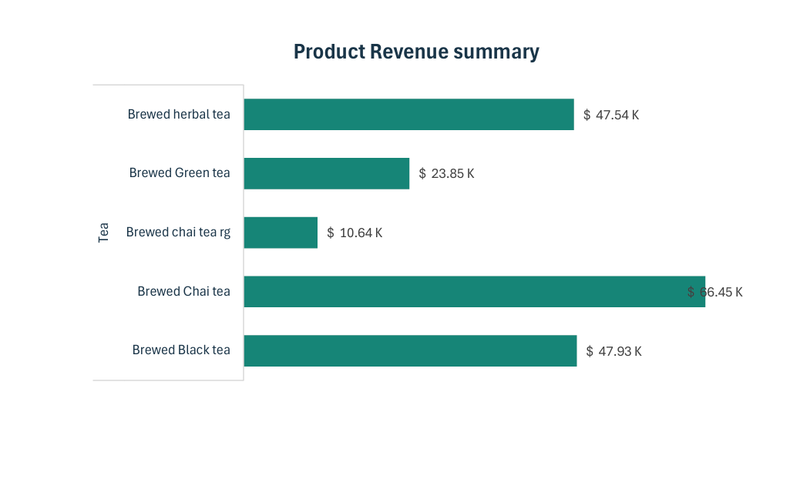
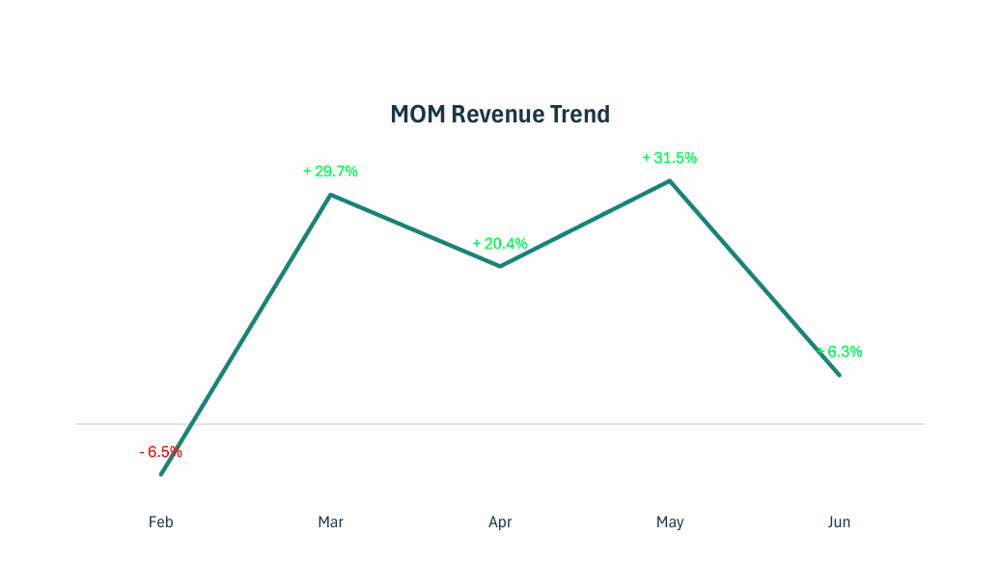
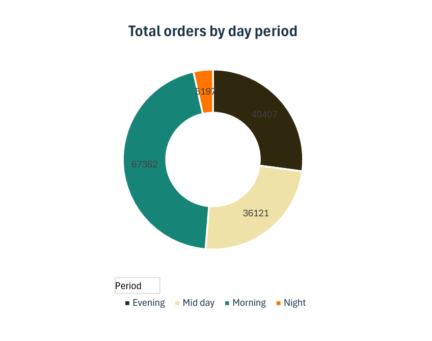
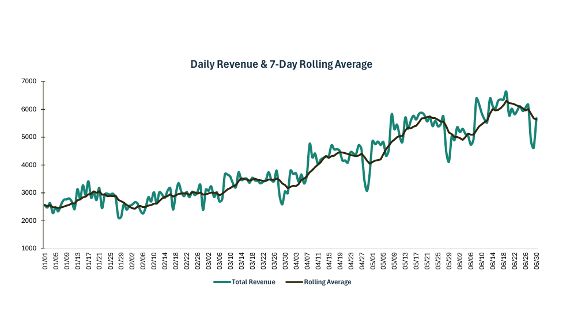
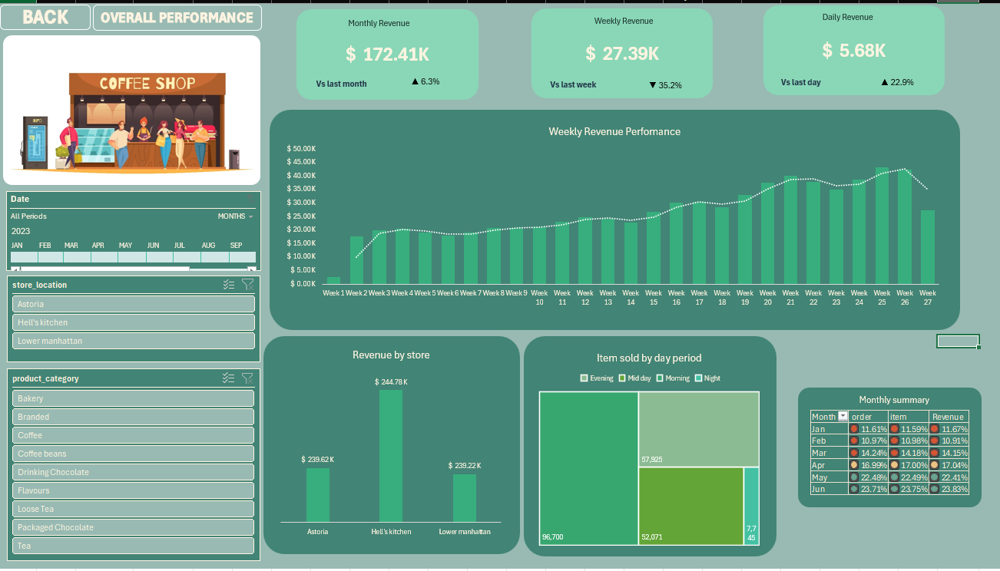
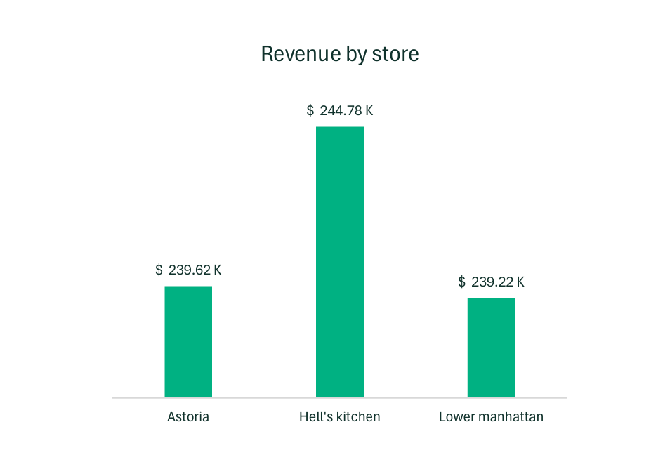
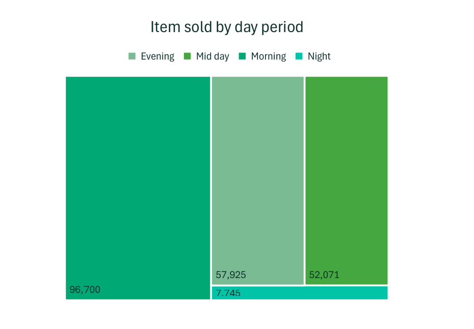
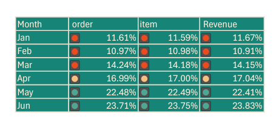

# Coffee-Shop-Sales-analytics

## Sales Overview

##  Key Performance Indicators

- **Sales Revenue:** **$723.62K**
- **Orders Sold:** **149,087**
- **Average Order Value (AOV):** **$4.85**
- **Monthly Revenue Growth:** Revenue increased by **6.3% compared with the previous month**, indicating positive month-over-month performance.
- **Weekly Order Trend:** Orders declined by **32.8% compared with the previous week**, highlighting a significant short-term decline in order volume.
- **Daily AOV Trend:** Average order value remained **relatively stable, increasing by just 0.05% compared with the previous day**, suggesting minimal change in average customer spend per order

### Product Performance 

##  Coffee Category

The drill-down analysis identifies the products driving performance within the selected top-performing category

Barista Espresso is the leading product, generating $92.29K and contributing approximately 34.1% of the Coffee category's $270.84K total revenue
Gourmet Brewed Coffee ranks second with $70.02K, contributing approximately 25.9% of category revenue
Combined, these two products generat$162.31K, accounting for approximately 59.9% of total Coffee category revenue
The concentration of nearly 60% of category revenue across two products highlights their importance to overall 
Coffee category performance and makes them key products for inventory planning, promotions, and revenue optimization

##  Tea Category

Brewed Chai Tea is the leading product, generating $66.45K and contributing approximately 33.8% of the Tea category's $196.41K total revenue
Brewed Herbal Tea ranks second with $47.54K, contributing approximately 24.2% of category revenue
Combined, these two products generate $113.99K, accounting for approximately 58.0% of total Tea category revenue
The concentration of nearly 58% of category revenue across two products highlights their importance to overall
Tea category performance and identifies them as key products for inventory planning, promotional campaigns, and revenue optimization
Brewed Chai Tea leads Brewed Herbal Tea by $18.91K, reinforcing its position as the strongest individual product within the Tea category

##  The MoM revenue trend

The business experienced four consecutive months of strong month-over-month growth, culminating in a +31.5% increase in May, 
the strongest monthly growth recorded during the period
The growth trend was preceded by a relatively modest -6.5% decline in February, indicating that the business recovered quickly from the early-period setback
The sharp acceleration through May demonstrates a period of strong positive momentum, suggesting improving revenue performance over consecutive months
However, the subsequent slowdown indicates that the strong growth momentum may be starting to weaken, making the latest month important to monitor

##  Weekly Order Decline

Orders sold are down 32.8% vs last week
That's much more concerning than the relatively small daily AOV movement
Since AOV hasn't meaningfully increased, the business cannot compensate for 
a major decline in transaction volume through higher customer spending
Priority investigation:
Was there a reduction in store traffic
Did operating hours change
Were particular locations affected
Was there a promotion last week that wasn't repeated
Are specific products unavailable
Is the decline concentrated in certain days or periods

### Day Period Order Summary 

Morning is the critical sales window 
With 45.5% of orders, morning demand is substantially higher than any other period. This suggests 
businesses should prioritise staffing, inventory, promotions, and operational capacity during morning hours.
Demand is concentrated during daytime/evening
Morning , midday and evening account for approximately 96.5% of all orders 
This means the business has very little demand at night

### Daily Revenue Performance

The daily revenue trend indicates a positive underlying growth trajectory, with revenue increasing from approximately 
$2.5K–$3K early in the period to $5K–$6K+ in later periods. The upward movement in the rolling average further supports
sustained improvement in the business's revenue performance

Revenue momentum is positive, with later-period daily revenue consistently reaching higher levels than at the beginning of the period
The upward rolling average indicates that the improvement is not driven solely by isolated high revenue days, suggesting a broader positive trend
Despite the overall growth, the daily series shows significant fluctuations, with sharp spikes and declines indicating that revenue performance is not yet fully stable
This volatility creates a need to understand the operational and commercial factors behind unusually strong or weak days

The business is experiencing healthy revenue growth, but with inconsistent daily performance. Identifying 
the drivers of these fluctuations could help replicate high-performing periods while reducing the impact of weaker days

## Sales Overall Performance

1. Monthly revenue $172.41K — +6.3% vs last month
2. Weekly revenue $27.39K — -35.2% vs last week
3. Daily revenue $5.68K — +22.9% vs last day

The business is showing good monthly growth, but very significant short-term volatility
The main story is the overall business is growing, but the most recent week has experienced a sharp drop

Weekly revenue is currently $27.39K, down 35.2% from the previous week.
Looking at the weekly trend, revenue generally climbed from roughly $17–20K in the early weeks to $35–42K around Weeks 20–26.
Then
Week 26 = $42K
Week 27 = $27K
That's an impressive drop

This isn't simply a long-term decline because the longer-term trend is still upward
It looks more like a recent operational, demand, or timing issue

The daily revenue KPI is $5.68K, up 22.9% vs the previous day
This is important because it suggests the weekly decline may not necessarily represent a continuing downward trend

### Store Performance

The three stores are remarkably balanced
Hell's Kitchen leads, but only slightly. Astoria and Lower Manhattan are almost identical
That's actually a positive sign the business isn't dependent on one location
However, because the stores are so similar in total revenue, the 35.2% weekly decline should be investigated across 
all three locations, rather than assuming it is a single-store problem

### Item sales by day period

Morning is the strongest sales period, accounting for nearly half of all item sales
Night is extremely weak, with only 7,745 items sold — about 12.5× lower than Morning
Meanwhile, Evening + Midday account for approximately 51% of total item volume, while Morning alone contributes about 45%
Business takeaway: Sales are heavily concentrated in the Morning, while the Night period represents a significant under performing 
window and may warrant investigation into operating hours, customer demand, or product availability

### Monthly summmary 

This is a very strong growth trajectory
From January through June, revenue share rises from about 11.7% to 23.8%
May was a major acceleration, and June became the strongest month in the dataset
This supports the first dashboard's finding that the business had strong momentum through May/June

